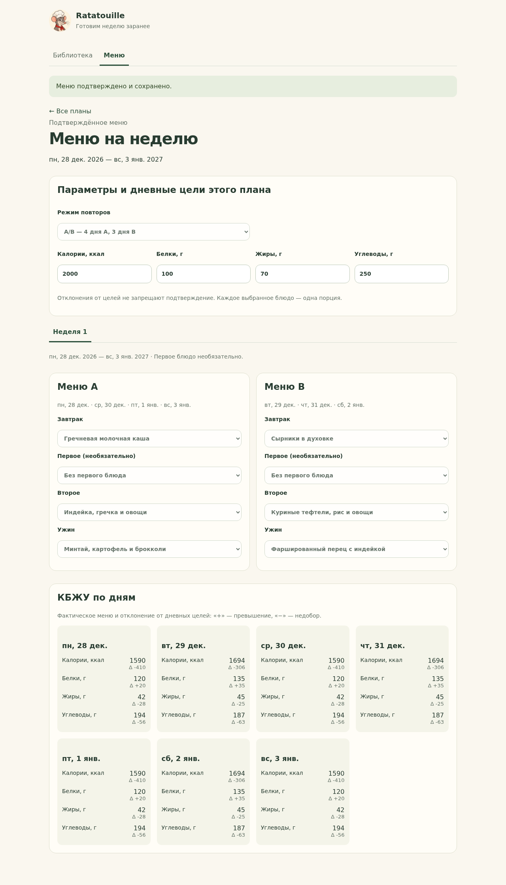
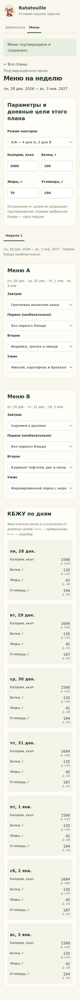

# Ручное меню T07

Задача согласована 9 октября 2026 года: владелец поручил проверить и слить представленный PR T06, затем выполнить следующую задачу. PR #19 слит, Issue #7 закрыта. Здесь описаны выбранные технические решения для ручного планирования.

## Работа с меню

В локальном приложении откройте «Меню». Задайте дневные цели вручную или измените их непосредственно при создании плана. Выберите начальную дату и 7 либо 28 дней. Предлагается ближайший понедельник по Europe/Moscow; можно выбрать другую дату. Недели — последовательные семидневные блоки от начала плана, включая переход месяца и года.

По умолчанию используется A/B. Для каждой недели доступны два шаблона: A на дни 1, 3, 5, 7 и B на дни 2, 4, 6. Чередование выбрано для понятного отображения четырёх и трёх дней. Выбор блюда в шаблоне изменяет только указанный слот всех показанных дней одной недели и сохраняется одной транзакцией. Каждая из четырёх недель имеет собственные A/B.

В режиме ограничения блюда выбираются по дням. Начальный лимит — три появления одного рецепта за неделю по всем четырём слотам. Разные версии одного рецепта учитываются вместе; в следующей неделе счётчик начинается заново. Лимит можно менять. Техническая граница целочисленного ввода — `9007199254740991`, чтобы JSON-число точно представлялось в клиенте и помещалось в SQLite.

Завтрак, второе и ужин заполняются перед подтверждением. Первое можно оставить пустым либо выбрать любое блюдо: обязательного супа нет. Ручной выбор доступен для активных рецептов без требования допуска к автоматическому подбору. В каждой позиции ровно одна порция; размеры порций автоматически не меняются.

КБЖУ пересчитываются по фактическому меню. Для каждого дня показаны суммы и подписанное отклонение от целей. Превышение или недобор не мешают подтверждению. Расчёты используют основу T05, сохраняют Decimal без преобразования в float; клиент отображает точные строковые значения с десятичной запятой. Покупки и партии также пересчитываются внутренней расчётной функцией; их пользовательский интерфейс относится к T10.

## Черновик и сохранение

Выбор блюд сохраняется в черновике, который можно продолжить из списка планов после перезагрузки. Ручные правки режима и целей применяются кнопкой «Сохранить параметры». Пока они не сохранены, выбор блюд и подтверждение заблокированы. Переход между разделами библиотеки и меню сохраняет состояние формы меню в текущей странице.

«Подтвердить меню» открывает отдельное подтверждение всего плана. Сервер в одной транзакции проверяет номер черновика, ранее подтверждённую ревизию, обязательные слоты и режим повторов, затем переключает сохранённый план. Режим нельзя молча ослабить; исправьте блюда либо явно поменяйте параметры. Неполный или нарушающий режим черновик можно продолжать редактировать.

Редактирование сохранённого меню создаёт копию с прежними датами, рецептами и целями. Отмена всего черновика требует подтверждения и оставляет сохранённое меню без изменений. Снимки рецептов и целей сохраняются даже после изменения библиотеки или общих целей. Существующие архивные версии остаются в меню, но заново добавить архивный рецепт нельзя.

Общие «цели для новых планов» сохраняются отдельным действием. Изменение целей черновика не меняет общие цели; отмена не затрагивает их. Два черновика одного плана могут существовать одновременно, но подтверждение одного делает другой устаревшим. Повтор запроса уже выполненного подтверждения безопасен и не откатывает указатель на более старое меню.

## Интерфейсы и границы

`menus.py` содержит контракты и атомарные операции; `menu_api.py` — синхронные HTTP-обработчики. Клиент использует `MenuPlanner.tsx` и `menus.ts`. Новая миграция не нужна: используются планы, ревизии, позиции и цели T05.

| Маршрут | Назначение |
|---|---|
| `GET /api/menu/defaults` | Начальная дата по Europe/Moscow |
| `GET/PUT /api/menu/goals` | Ручные цели для новых планов |
| `GET/POST /api/menu/plans` | Личный список и создание черновика |
| `POST /api/menu/plans/{id}/draft` | Копия сохранённого плана |
| `GET /api/menu/revisions/{id}` | Меню, точные суммы и проблемы заполнения |
| `PUT /api/menu/revisions/{id}/settings` | Явное изменение режима, лимита и целей |
| `PUT /api/menu/revisions/{id}/entries` | Атомарный выбор или очистка одного либо нескольких слотов |
| `POST /api/menu/revisions/{id}/confirm` | Подтверждение всего плана |
| `POST /api/menu/revisions/{id}/cancel` | Отмена черновика |

Владелец берётся из локального процесса, клиент не передаёт `owner_id`. Используются loopback, проверка Host/Origin, обязательный заголовок приложения для записи и `Cache-Control: no-store`, введённые в T06. Устаревшие запросы получают 409; ошибки ввода — 422 без частичной записи. Основной ASGI-процесс не подключает личные маршруты и объявляет `menus: false`.

Запуск описан в [README](../README.md). Авторизация Telegram относится к T11, автоматический подбор — к T08; T07 их не добавляет.

## Проверка

Серверные проверки покрывают 7/28 дней, независимые недельные пары A/B с 4+3, необязательное первое, обязательные остальные слоты, лимиты по всем слотам и версиям, точные суммы и мягкие цели. Проверены атомарный отказ пачки, архивные снимки, чужие идентификаторы, устаревшие записи, одновременные подтверждения, безопасный повтор, отмена и переполнение целочисленного ввода. Полная проверка: `bash tools/dev/check.sh`.

Результаты браузера и публикационного снимка записываются в [перечень публикации](PUBLICATION_MANIFEST.md). Скриншоты сделаны на отдельной тестовой базе с обезличенными стартовыми рецептами.

