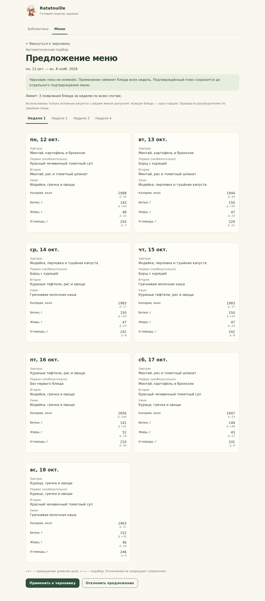
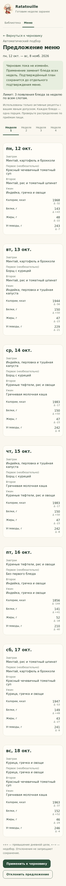

# Автоматическое предложение меню T08

Задача согласована 9 октября 2026 года: владелец поручил провести ревью PR #20 T07, слить при успешной проверке и выполнить следующую задачу. PR #20 слит после повторной общей проверки и независимого ревью; Issue #8 закрыта. Реализация T08 проверена и представлена в [PR #21](https://github.com/Sphag/ratatouille/pull/21); Issue #9 остаётся открытой до слияния.

## Сценарий

Создайте или откройте черновик меню на 7 либо 28 дней. Задайте дневные цели, выберите A/B или недельный лимит и сохраните параметры. Кнопка «Предложить меню» рассчитывает вариант и показывает блюда и КБЖУ всех недель. До применения черновик не изменяется.

«Отклонить предложение» возвращает прежний черновик. «Применить к черновику» заменяет все его блюда одной операцией; цели, даты и режим сохраняются. После этого можно вручную редактировать меню и отдельно подтвердить весь план обычным действием T07. Сам подбор не подтверждает и не сохраняет план. Отмена изменённого черновика сохраняет прежний подтверждённый план.

## Строгие условия

- Используются только текущие версии личных активных рецептов с явным допуском. Архивные, недопущенные и чужие рецепты исключены. Импорт библиотеки сам по себе не даёт допуска.
- В A/B одинаковое меню A назначается дням 1/3/5/7, B — дням 2/4/6 каждой недели. Лимит второго режима не применяется. Каждая неделя цикла подбирается отдельно.
- В ограниченном режиме считается каждое появление рецепта по всем слотам одной недели. Начальный лимит — три; значение берётся из черновика и не увеличивается автоматически. Недельные счётчики сбрасываются.
- Завтрак, второе и ужин заполнены. Первое необязательно: алгоритм может добавить или убрать его при улучшении результата. В каждом выбранном слоте одна полная порция. Выход рецепта не масштабирует его ручные КБЖУ.

Библиотека T06 не содержит назначения рецептов по приёмам пищи. Допущенный рецепт может попасть в любой слот; тип блюда не выводится из названия или отчёта. Перед применением пользователь проверяет распределение по приёмам пищи.

Если допущенных активных рецептов нет, приложение предлагает добавить рецепты или подтвердить допуск. Для ограниченного режима нужна вместимость не менее 21 обязательного появления: число допущенных рецептов × лимит ≥ 21. При меньшей вместимости отображается число доступных появлений и предложения явно увеличить лимит, выбрать A/B или допустить больше рецептов. Ни одно из этих действий не выполняется автоматически. Черновик остаётся прежним. Недобор или превышение КБЖУ не является конфликтом.

## Алгоритм и выбранные решения

Алгоритм детерминированный, без AI и внешних сервисов. Сначала обеспечивается допустимость и вместимость. Затем сравнивается сумма дневных отклонений, затем разнообразие. Сравнение лексикографическое: разнообразие не может ухудшить найденную оценку КБЖУ.

Для каждой величины используется `abs(факт − цель) / max(цель, 1)`. Все четыре величины имеют одинаковый вес; нормирование не позволяет калориям автоматически перевесить белки, жиры и углеводы из-за разницы единиц. Нулевая цель имеет знаменатель 1. Значения и сравнения — точные Fraction из вручную введённых Decimal; расчёт КБЖУ по ингредиентам и медицинские ограничения не добавляются. В A/B оценки дневных шаблонов умножаются на 4 и 3; в ограниченном режиме оцениваются все семь дней.

Второй критерий — сумма квадратов числа появлений каждого рецепта за текущую неделю плюс удвоенное произведение его появлений в текущей и предыдущей неделях. Он предпочитает распределять блюда между рецептами и уменьшать совпадения с соседней неделей при одинаковой оценке КБЖУ.

Используются три детерминированных жадных старта, затем до шести проходов замен отдельных позиций, добавления/удаления первого и обмена блюдами между днями. Замены и обмены сохраняют ограничения; принимаются только улучшения пары оценок. В библиотеке больше 64 рецептов для каждой недели выбираются 64 кандидата по близости одной порции к 1/3 или 1/4 дневных целей, затем по прошлой неделе и стабильному ID. Вместимость выбранного набора достаточна даже при лимите 1: обязательных появлений 21. Все рецепты рассматриваются при ранжировании.

Это ограниченный эвристический поиск, а не гарантия глобально оптимального меню. Детерминированность упрощает воспроизведение и проверку; ограниченный объём поиска сохраняет отзывчивость при большой библиотеке. Ручное редактирование доступно после применения. На 18 публичных карточках отдельный локальный замер 28 дней составил около 0,04 с для A/B и 0,47 с для лимита; это измерение этой среды, не обещание времени на других системах.

## Применение и HTTP

`generation.py` рассчитывает вариант без доступа к БД. `proposals.py` загружает согласованный снимок черновика и допущенных рецептов в транзакции чтения, закрывает её перед поиском и формирует точные дневные суммы через расчёты T05. `MenuProposal.tsx` показывает отдельный экран просмотра.

| Маршрут | Действие |
|---|---|
| `POST /api/menu/revisions/{id}/proposal` | Просмотр предложения по `expected_number`, без записи |
| `PUT /api/menu/revisions/{id}/proposal` | Применение позиций с исходным номером и контрольной суммой |

Контрольная сумма связывает идентификатор, номер черновика и позиции; это проверка целостности, не авторизация. Владелец определяется сервером. При применении сервер заново проверяет текущую версию каждого выбранного рецепта, допуск, архив, дни, уникальность позиций, заполнение и режим. Проверка и полная замена позиций выполняются под `BEGIN IMMEDIATE`; номер увеличивается один раз. Подмена контрольной суммы не обходит предметные проверки.

Если рецепты или черновик изменились между просмотром и применением, возвращается 409 без частичной записи. Перечитайте черновик и повторите подбор. Повтор уже применённого запроса также получает 409; перечитывание показывает сохранённый результат. Отсутствие рецептов и недостаточная вместимость дают 422 с объяснением.

Используется локальная HTTP-граница T06/T07: loopback, Host/Origin, заголовок приложения для записи, запрет кеширования и серверный владелец. В основном ASGI-процессе личные маршруты по-прежнему отсутствуют до T11. Новые зависимости и миграции не нужны. Замены с предложением изменений других блюд относятся к T09; покупки и партии в интерфейсе — к T10.

## Проверка

Автоматические проверки охватывают оба режима и 7/28 дней, точные дробные цели, полные порции, необязательное первое, вместимость и отсутствие допуска, недельные границы, соседние недели, приоритет целей над разнообразием, большую библиотеку и детерминированность. Проверены отсутствие записи при просмотре, применение только к черновику, отмена, отзыв допуска/архив/изменение версии, чужой владелец, устаревший номер, подмена данных, конкурентное применение и HTTP-граница. Полная проверка `bash tools/dev/check.sh` прошла: 156 тестов, Ruff, mypy (29 файлов), TypeScript, ESLint, Prettier и сборка Vite. Независимое ревью не выявило блокирующих замечаний.

Результаты браузера и публичного снимка записываются в [перечень публикации](PUBLICATION_MANIFEST.md). Иллюстрации используют отдельную тестовую базу и обезличенные рецепты.

