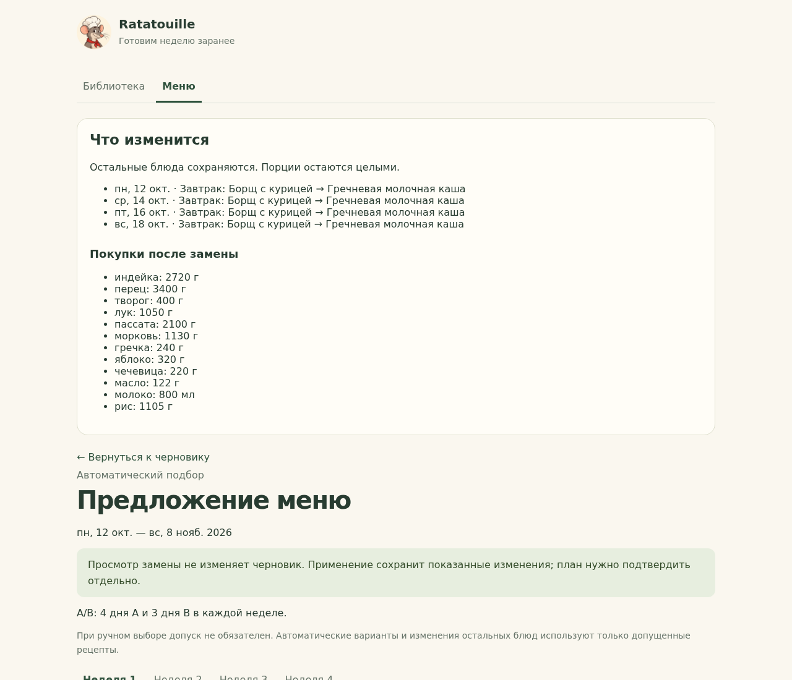

# T09 — замена и пересчёт

9 октября 2026 года владелец разрешил автономный цикл разработки T09–T15: задача, PR, ревью, слияние и переход к следующей. PR #21 T08 проверен и слит; Issue #9 закрыта.

Откройте заполненный черновик и выберите «Заменить блюдо с просмотром». Укажите день и слот, выберите рецепт вручную либо один из пяти подходящих допущенных вариантов. В A/B выбранный слот заменяется во всех днях соответствующего шаблона одной недели. В режиме лимита меняется одна позиция. Остальные недели сохраняются.

Два сценария доступны явно:

- «Оставить без изменений» сохраняет остальные блюда и порции. Если замена нарушает лимит, приложение объясняет конфликт и не меняет черновик.
- «Предложить изменения для приближения к целям» фиксирует выбранное блюдо и предлагает изменения остальных позиций только этой недели. Используется точный ограниченный поиск T08 с заблокированной выбранной позицией; другие недели не пересобираются. При превышении лимита сначала заменяются незаблокированные лишние появления. Все автоматические позиции используют текущие активные версии с явным допуском; если исходная неделя содержит другие версии, приложение предлагает проверить библиотеку или выбрать сохранение остальных блюд. Цели имеют приоритет над разнообразием; соседние недели участвуют во втором критерии.

Просмотр показывает полный список изменяемых позиций, КБЖУ и покупки нового черновика. Применение отдельно записывает показанный результат. Сохранение плана требует подтверждения T07; отмена оставляет ранее подтверждённый план. Порции не масштабируются, необязательное первое может быть удалено или добавлено только в сценарии изменения остальных блюд.

Ручной выбор допускает активный рецепт без допуска, как T07. При выборе автоматического варианта допуск повторно проверяется при просмотре и применении. Автоматический подбор остальных блюд также требует допуска выбранного рецепта. Исторические снимки остальных блюд в первом сценарии сохраняются.

## Контракты

| Маршрут | Назначение |
|---|---|
| `POST /api/menu/revisions/{id}/replacement-options` | До пяти допустимых вариантов по дневным КБЖУ, без записи |
| `POST /api/menu/revisions/{id}/replacement` | Просмотр выбранного рецепта и сценария, без записи |
| `PUT /api/menu/revisions/{id}/replacement` | Повторная проверка и атомарное применение по контрольной сумме |

Запросы содержат номер черновика, день, слот и для просмотра/применения текущую версию выбранного рецепта, сценарий и признак автоматического выбора. Владелец задаётся сервером. Данные клиента не считаются готовыми позициями: сервер строит результат заново, сравнивает контрольную сумму полного предложения, проверяет заполнение, режим, версии и допуск, затем заменяет позиции под `BEGIN IMMEDIATE`. Изменённый черновик или рецепт, отзыв допуска автоматического выбора и подмена суммы дают отказ без частичной записи. Конкурентные применения не могут записать результат дважды.

КБЖУ и покупки входят в каждый ответ меню и пересчитываются по фактическим снимкам после любой ручной или автоматической замены. Количества используют расчёты T05 с выходом рецепта и совместимыми единицами; масса и объём остаются раздельными. Чек-листы и партии в интерфейсе — T10.

## Проверки

Общая команда: `bash tools/dev/check.sh`. Проверяются оба сценария и режима, сохранность остальных недель и подтверждённого плана, фиксированная замена, недельный лимит, точные КБЖУ и покупки, отсутствие записи при просмотре, устаревшие и конкурентные запросы, архив, версия, допуск, чужой владелец и закрытая HTTP-граница. Результаты и иллюстрации записываются в [перечень публикации](PUBLICATION_MANIFEST.md).

