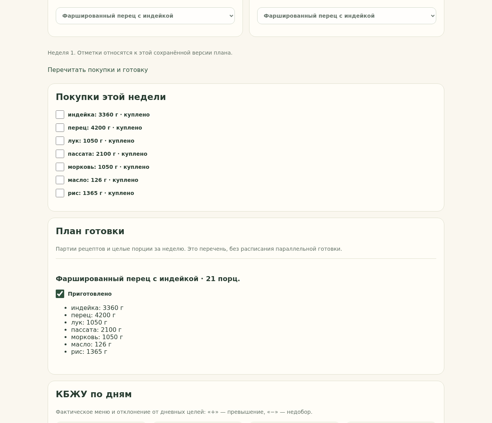

# T10 — покупки, партии готовки и чек-листы

Задача разрешена автономным поручением владельца 9 октября 2026 года. PR #22 T09 проверен и слит; Issue #10 закрыта.

В редакторе и сохранённом меню каждой недели отображаются покупки и партии готовки. Покупки объединяют ингредиент по его личному ID и совместимой единице: кг переводятся в г, л в мл, штуки сохраняются отдельно. Масса и объём не объединяются. Выход рецепта определяет долю ингредиентов на одну полную порцию; КБЖУ по ингредиентам не рассчитываются.

Для каждой партии показаны неизменяемая версия рецепта, число целых порций за неделю и суммарные ингредиенты. Разные версии одного рецепта не смешиваются. Список не содержит цен, округления до упаковок, домашних запасов, расписания параллельной готовки или отметок съеденного.

«Куплено» и «Приготовлено» доступны только в подтверждённой версии меню. Состояние сохраняется на сервере и восстанавливается после перезагрузки. Недели и несовместимые единицы отмечаются отдельно. Изменение или архивирование исходного рецепта не меняет сохранённые количества. Отмена копии сохраняет отметки исходного меню. Новая подтверждённая версия начинает с пустых отметок: количество или состав могли измениться, поэтому переносить старые отметки автоматически нельзя. Старые версии сохраняют свои отметки.

## HTTP и защита

| Маршрут | Назначение |
|---|---|
| `GET /api/menu/revisions/{id}/fulfilment` | Расчёты и отметки по всем неделям |
| `PUT /api/menu/revisions/{id}/shopping-check` | Состояние покупки по неделе, ингредиенту и единице |
| `PUT /api/menu/revisions/{id}/cooking-check` | Состояние партии по неделе и версии рецепта |

Сервер задаёт владельца, проверяет принадлежность версии и наличие строки в фактическом расчёте. Запись требует подтверждённого меню и `expected_checked`, совпадающего с сохранённой отметкой. Сравнение и изменение выполняются в одной транзакции `BEGIN IMMEDIATE`, не меняя номер или содержимое неизменяемого меню. Устаревшая отметка возвращает 409; «Перечитать покупки и готовку» восстанавливает актуальный список. Чужая или отсутствующая строка даёт 404. Ошибка сети не устанавливает галочку в интерфейсе до успешного ответа.

До T11 маршруты используют локальную границу T06. Существующая схема T05 достаточна; зависимостей и миграций не добавляется.

## Проверка

`bash tools/dev/check.sh` проверяет точные количества и отдельные единицы, 7/28 дней, партии с выходом рецепта, запрет отметок черновика, сохранение после пересоздания сервиса, независимость недель и версий, архивирование, чужие объекты, устаревшие и конкурентные изменения. Проверка браузера выполняется на отдельной тестовой базе. Итоги записаны в [перечень публикации](PUBLICATION_MANIFEST.md).

