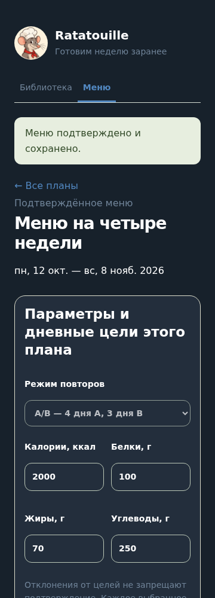

# T11 — Telegram и Mini App

PR #23 T10 проверен и слит. В автономном объёме реализованы приватный `/start`, кнопка Mini App, подписанная авторизация и адаптация темы/безопасных отступов. Личный интерфейс остаётся в Mini App; бот не дублирует редактор.

## Запуск

После явной миграции БД экспортируйте переменные из `.env.example`: `BOT_TOKEN`, `RATATOUILLE_APP_URL` (HTTPS в корне сайта), `RATATOUILLE_OWNER_TELEGRAM_ID` и `RATATOUILLE_DB_PATH`. Значения `.env` автоматически не загружаются. Запустите `uvicorn ratatouille.server:production_app --factory` и отдельно `python -m ratatouille.bot` в установленном окружении. Настройка BotFather и TLS описывается в T14. До настройки приложение в Telegram не запускается; локальный режим T06 сохраняется.

Первая версия допускает только настроенного владельца. ID берётся из проверенной подписи, затем связывается с внутренним UUID; клиент не выбирает владельца. Сервер проверяет HMAC SHA-256 по Telegram WebAppData, уникальные поля, размер, дату (час, допустимое опережение 30 секунд), положительный целочисленный ID. Данные `initDataUnsafe` не используются. Авторизация передаётся в заголовке, не сохраняется в URL, логах или localStorage. По истечении часа нужно открыть приложение заново. Каждый личный маршрут требует авторизации и проверяет принадлежность объекта; неверная подпись — 401, закрытый доступ — 403, чужие объекты — 404. Запись дополнительно требует собственного Origin и заголовка приложения.

Браузерный SDK подключается с официального адреса Telegram. Тема, безопасные отступы, ready/expand и предупреждение закрытия применяются при открытии. Без initData отображается инструкция открыть приложение в Telegram. Обработка ошибок и повторная загрузка используют существующие формы.

## Проверка и граница готовности

199 тестов, Ruff, mypy и проверки клиента/сборка прошли. Отдельное ревью авторизации не выявило дефектов. В Chromium с синтетической подписанной сессией и подменённым SDK проверены библиотека, сохранение целей, меню, тёмная тема и отсутствие горизонтальной прокрутки на 320/360/1280. Ревью выявило и устранило белый фон полей в тёмной теме и нормализацию Origin для стандартного порта/регистра hostname.

Настоящий BOT_TOKEN, адрес HTTPS и Telegram ID в окружении не настроены. Проверка Telegram Desktop/Android/iOS не выполнена; Issue #12 остаётся открытой до неё. Подменённый SDK проверяет интерфейс и серверную границу, но не выдаётся за приёмку реального Telegram.

