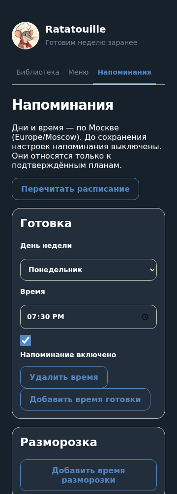

# T12 — расписание, доставка и ошибки

PR #24 T11 проверен и слит. Владелец разрешил автономные технические решения T09–T15; перечисленные ниже правила выбраны в рамках этого поручения.

## Поведение

При первом открытии интерфейс предлагает раздел «Напоминания». До сохранения расписание пустое и отправок нет. Готовка и разморозка задаются независимо: день недели, время ЧЧ:ММ по Europe/Moscow и явный переключатель. До семи времён каждого вида, одно на день недели. Запись атомарна и проверяет digest предыдущих настроек; конфликт другой вкладки требует перечитывания. Настройки личные и переживают перезапуск.

События относятся только к текущим подтверждённым версиям планов в пределах их дат. Сообщение содержит названия недельных блюд. Разморозка напоминает вручную проверить продукты: сведения о хранении и автоматически выбранные продукты отсутствуют. Планы с пересекающимися датами дают отдельные напоминания; отметка партии не выключает заданное расписание.

## Надёжность

Polling-процесс бота проверяет события каждые 15 секунд, догоняет опоздания до 15 минут. Более старые события не рассылаются после длительного простоя. SQLite миграция `0003` добавляет журнал доставки и часовые отметки уведомлений о сбоях. Ключ события: владелец, план, вид и календарная дата; новая ревизия или перенос времени не дублируют уже отправленное событие этого дня. Заведомо отменённое до доставки событие можно заново поставить по актуальному времени.

Перед отправкой транзакция `BEGIN IMMEDIATE` фиксирует claim, проверяет действующее расписание и подтверждённую версию. Только явный ответ Telegram RetryAfter разрешает повтор, с указанной задержкой и максимум тремя попытками в пределах 15 минут. Запрет/ошибка запроса завершают доставку. Тайм-аут, неопределённая сеть или падение после claim отмечаются `uncertain`: автоматический повтор мог бы создать дубликат. Это сознательный выбор защиты от дублей ценой возможного пропуска. Событие, уже взятое на отправку, нельзя отозвать после начала сетевого запроса.

Сохранение расписания отменяет pending. Если настройка меняется во время неудачной отправки, повтор проверяет её заново. После перезапуска отправленные, отменённые и неопределённые исходы сохраняются; независимые процессы не могут повторно взять одну pending-строку. Журнал — таблица `reminder_deliveries`; его содержимое не выдаётся в публичном health-маршруте.

Ошибки адресуются настроенному владельцу бота: одно нейтральное сообщение в час, с долговечной отметкой до отправки. При недоступном Telegram остаётся журнал процесса, повторной цепочки сообщений нет. Логи содержат класс/статус ошибки, фильтруют токен и не печатают traceback пользовательских данных. Настройки при ошибках не перезаписываются. API сервера возвращает существующие нейтральные ошибки; сообщения владельцу охватывают сбои бота/доставки.

## Проверка

211 тестов и все проверки проекта прошли; часы и отправитель подменены в тестах. Проверены срок, UTC/Moscow, отсутствие расписания/подтверждения, выключенный вид, сохранение и конфликт, перезапуск и недублирование, RetryAfter, запрет, тайм-аут, потерянный claim, гонка отключения и перенос времени. Chromium проверил сохранение, восстановление и 320/360/1280 без горизонтальной прокрутки. Реальная доставка требует окружения Telegram T11/T14 и пока не проверена.

