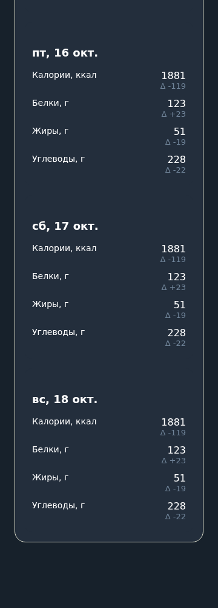

# T13 — календарь готовки и разморозки

PR #25 T12 проверен и слит. На экране подтверждённого меню кнопка «Скачать ICS» выдаёт личный файл `ratatouille.ics`. Авторизация остаётся в заголовке запроса, не в адресе файла. Чужой план недоступен; черновик без подтверждённого плана не экспортируется.

## События

Экспортируются включённые события настроенного расписания T12 в пределах текущего подтверждённого плана. Пустое/выключенное расписание даёт пустой календарь. События готовки и разморозки содержат названия блюд недели, без автоматических правил хранения. Приёмы пищи и напоминания VALARM не экспортируются. DTSTART задаётся по Europe/Moscow, VTIMEZONE строится по tzdata для диапазона плана. События обозначают момент начала; длительность готовки не выдумывается.

Формат [RFC 5545](https://www.rfc-editor.org/rfc/rfc5545) обеспечивает библиотека icalendar 7.3.0: CRLF, экранирование текстов и перенос UTF-8 строк до 75 байт. Миграция `0004` сохраняет digest, SEQUENCE и время версии календаря. В одной транзакции читаются личные настройки и текущий план. UID зависит от внутреннего владельца, плана, вида и даты; время и новая ревизия его не меняют. Неизменённый повторный экспорт побайтно одинаков. Изменение подтверждённого меню или расписания увеличивает SEQUENCE; черновик и отмена его не затрагивают.

## Ручной импорт

Выбран общий способ без зависимости от обработки UID календарным клиентом: создать отдельный календарь для каждого плана и импортировать файл. Для обновления удалить прежний календарь этого плана и импортировать актуальный файл в новый пустой календарь. Не импортировать поверх старых событий: клиенты могут дублировать даже стабильные UID, а удалённые из файла события могут остаться. Другие личные календари удалять не нужно. Файл содержит личные названия блюд, его не следует публиковать. Подписка и внешняя синхронизация не добавляются.

## Проверка

216 тестов и проверки проекта прошли. Проверены разбор ICS, TZID/момент UTC, 7/28-дневные ограничения общими расчётами, UTF-8 строки, UID, SEQUENCE, изменение расписания/подтверждённого меню, неизменность при черновике/отмене, закрытый доступ, отсутствие инъекции компонентов через название. Chromium скачал файл; отдельно разобран именно скачанный файл (четыре события по Москве), 320/360/1280 без прокрутки.

Календарный клиент в окружении не установлен. Импорт и повторный импорт в выбранном реальном клиенте не выполнены: Issue #14 остаётся открытой до этой проверки.

