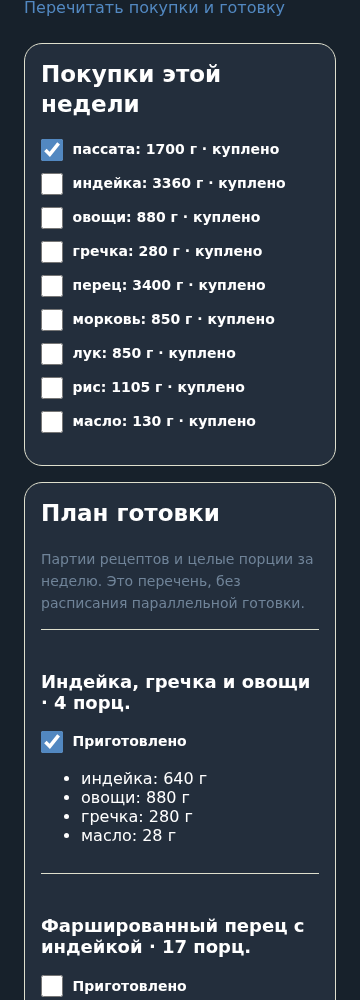

# T15 — приёмка первой версии

9 октября 2026 года. PR #27 T14 проверен и слит; [CI текущего HEAD](https://github.com/Sphag/ratatouille/actions/runs/37964404312) прошёл: checks и container. Автономный цикл T09–T15 разрешён владельцем. Ниже отделены проверенная реализация и внешняя приёмка, для которой отсутствует настроенная среда.

## Полный сценарий

`tests/test_acceptance.py` проходит подписанный вход, импорт 18 карточек без автоматического допуска, отказ подбора до допуска, цели, 28-дневный A/B-план, предложение, просмотр замены с пересчётом, применение и отдельное подтверждение. Затем проверяются покупки/готовка, отметки, копия и отмена, отсутствие отправки до настройки, расписание, тестовая доставка, ICS, изоляция второго владельца и ошибки ввода. После пересоздания engine/приложения сохраняются цели, расписание, отметки и файл; напоминание не дублируется.

Chromium с синтетической подписанной сессией и SDK прошёл редактирование копии, выбор автоматической замены, пересчёт, просмотр, применение, отдельное «Да, сохранить план», обе отметки, перезагрузку и скачивание ICS. Подтверждение требует второго действия — изменение черновика само не подтверждает план. Светлая/тёмная темы и ширины 320/360/1280 проверены в T09–T13. Тестовые базы и авторизация не публикуются.

## Шесть требований

| Критерий | Проверка | Результат |
|---|---|---|
| A/B допускает четыре A дня без лимита другого режима | test_ab_ignores_limited_cap_and_optional_first_added_only_when_useful; test_ab_has_four_a_three_b_with_independent_templates_each_week; общий сценарий | Пройден |
| При лимите три четвёртый повтор запрещён по всем слотам | test_strict_limit_wins_over_exact_targets_and_capacity_resets_every_week; test_limit_counts_all_slots_and_recipe_versions_separately_each_week | Пройден |
| Недостаточная библиотека объясняет конфликт без ослабления | test_impossible_capacity_has_explanation_and_never_relaxes; отказ до допуска в общем сценарии | Пройден |
| Замена пересчитывает КБЖУ и покупки, остальные блюда — по сценарию | test_keep_preserves_other_positions_and_weeks_exact_shopping_and_saved_plan; test_rebalance_locks_selected_and_other_weeks_and_improves_goals | Пройден |
| Подтверждение сохраняет, отмена копии не меняет прежний план | test_configure_and_cancel_preserve_saved_menu_and_personal_goals; общий сценарий | Пройден |
| Без настройки нет напоминаний | test_schedule_off_until_saved_validation_conflict_and_restart; общий сценарий | Пройден |

222 теста, Ruff/mypy, TypeScript/ESLint/Prettier и сборка прошли. Дополнительно проверены неправильные даты/числа, конкурентные изменения, повреждённые/устаревшие подписанные данные, запрет чужих объектов, immutable-снимки, перезапуск, ошибки Telegram и резервирование. Отметок съеденного, автоматического масштабирования и AI нет.

## Внешние проверки, которые остаются

| Issue | Что требует настоящей среды |
|---|---|
| [T11 #12](https://github.com/Sphag/ratatouille/issues/12) | Настроенные бот/HTTPS/ID; открыть и пройти сценарий в Telegram Desktop/Android/iOS, проверить тему, отступы и скачивание |
| [T13 #14](https://github.com/Sphag/ratatouille/issues/14) | Выбрать установленный календарный клиент; импортировать, затем удалить отдельный календарь и повторить импорт обновлённого файла, проверить отсутствие дублей |
| [T14 #15](https://github.com/Sphag/ratatouille/issues/15) | VPS, домен, бюджет, SSH/environment; проверить настоящий HTTPS, доставку, обновление и откат на отдельный восстановленный том |
| [T15 #16](https://github.com/Sphag/ratatouille/issues/16) | После трёх предыдущих проверок пройти конечный пользовательский сценарий без разработчика и зафиксировать итог выпуска |

В текущем окружении нет настроенных токена/ID/HTTPS, адреса VPS и календарного клиента. Они не подменяются тестовыми значениями при объявлении выпуска. Указанные Issues остаются открытыми; локальная проверка не означает окончательное принятие сервиса.

Обнаруженные при автономных ревью дефекты исправлены до слияния: контраст темы и нормализация Origin, гонки отключения/переноса напоминаний, пути ресурсов установленного пакета и повторный выпуск SHA, переключение тома при откате. Новых подтверждённых дефектов после проверки нет. Продуктовые расширения за пределами первой версии остаются вне объёма; исходные личные материалы не опубликованы.

